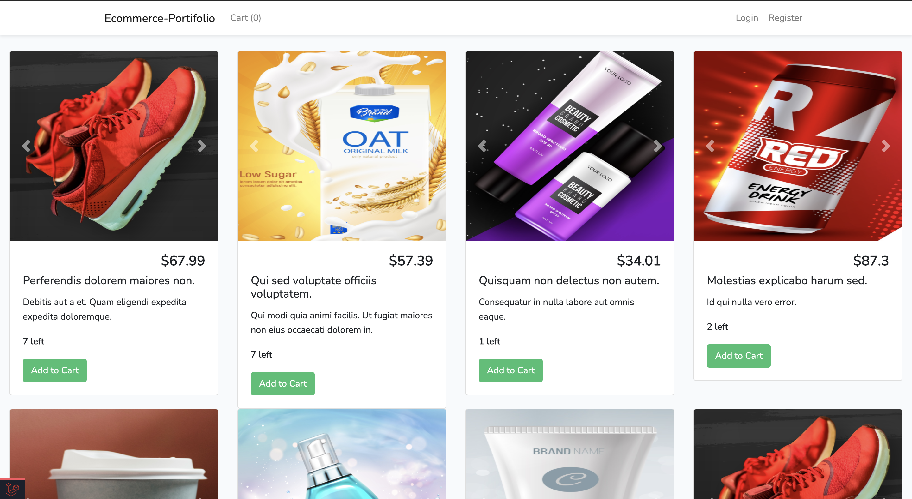

 # 

## Shopping Cart Application 
 An E-commerce website made with Laravel framework. It was created for varsity course project.

 ##Installation Process
 
 1: Clone the repo and cd into it
 
 2: composer install
 
 3: Rename or copy .env.example file to .env
 
 4: php artisan key:generate
 
 5: Set your database credentials in your .env file
 
 6: npm install && npm run dev
 
 7:php artisan serve or use Laravel Valet 
 
 
 
